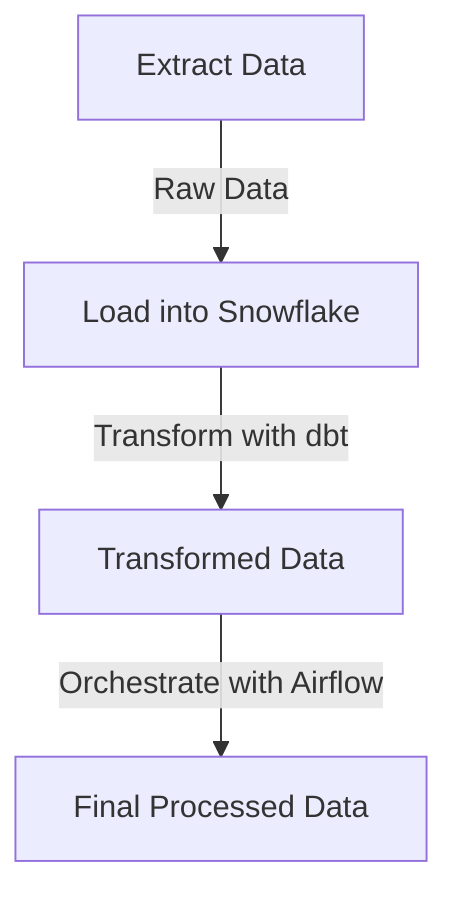

# ELT Pipeline with dbt, Snowflake, and Airflow

## Overview
This project demonstrates an **ELT (Extract, Load, Transform) pipeline** using **dbt (Data Build Tool), Snowflake (Cloud Data Warehouse), and Apache Airflow (Workflow Orchestration)**. The pipeline extracts data from **Snowflake's TPC-H sample dataset (tpch_sf1)**, loads it into Snowflake, and transforms it using dbt.

## Features
- **Data Extraction**: Extracts data from **Snowflake's TPC-H sample dataset (tpch_sf1)**.
- **Loading into Snowflake**: Uses Snowflake as the cloud data warehouse.
- **Data Transformation**: Utilizes dbt for transformations of the TPC-H dataset.
- **Orchestration with Airflow**: Automates and schedules the pipeline.
- **Modular and Scalable**: Easily adaptable for different datasets and transformations.

## Technologies Used
- **Snowflake**: Cloud-based data warehouse with TPC-H sample dataset (tpch_sf1)..
- **dbt**: Transformation framework for analytics.
- **Apache Airflow**: Workflow automation and orchestration.
- **Python**: Scripting and automation.
- **Docker** (optional): Containerization for deployment.

## Architecture


## Setup and Installation

### Prerequisites

Before setting up the pipeline, ensure you have the following:

- A **Snowflake account**.
- **Python** installed (version 3.8 or higher recommended).
- **Airflow** installed (`pip install apache-airflow`).
- **dbt** installed (`pip install dbt-snowflake`).
- **Docker** (optional, for containerized deployment).

---

## Steps to Run the Pipeline

### 1. Clone the Repository

```sh
git clone https://github.com/your-username/ELT_Pipeline.git
cd ELT_Pipeline
```

### 2. Configure Snowflake Connection

Set up your Snowflake credentials in the `profiles.yml` file for dbt:

```yaml
snowflake:
  target: dev
  outputs:
    dev:
      type: snowflake
      account: your_account
      user: your_user
      password: your_password
      role: your_role
      warehouse: your_warehouse
      database: your_database
      schema: your_schema
      threads: 4
```

### 3. Initialize dbt
Run the following commands to test the connection, execute transformations, and validate the data:

```sh
dbt debug  # Check connection
dbt run    # Run transformations
dbt test   # Validate data
```

### 4. Start Airflow Scheduler and Webserver
Initialize the Airflow database and start the scheduler and webserver:

```sh
airflow db init
airflow webserver & airflow scheduler
```

### 5. Deploy and Monitor the Pipeline

- Access the Airflow UI at `http://localhost:8080`.
- Ensure the Snowflake connection is correctly configured in Airflow.
- Trigger DAGs manually or schedule them as needed.

## Folder Structure
```
ELT_Pipeline/
│── dags/                     # Airflow DAGs
│── dbt/
│   ├── models/               # dbt models
│   ├── profiles.yml          # dbt Snowflake config
│── scripts/                  # Custom scripts
│── Dockerfile                # Optional Docker setup
│── requirements.txt          # Python dependencies
│── README.md                 # Documentation
```
## Docker Deployment
If you prefer to use Docker for containerized deployment, ensure Docker is installed and run the following commands:
```sh
docker build -t elt_pipeline .
docker-compose up
```
